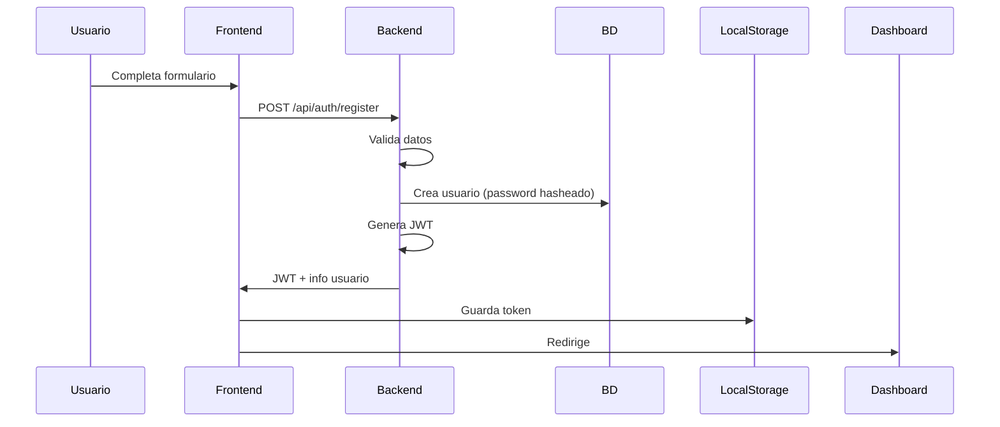
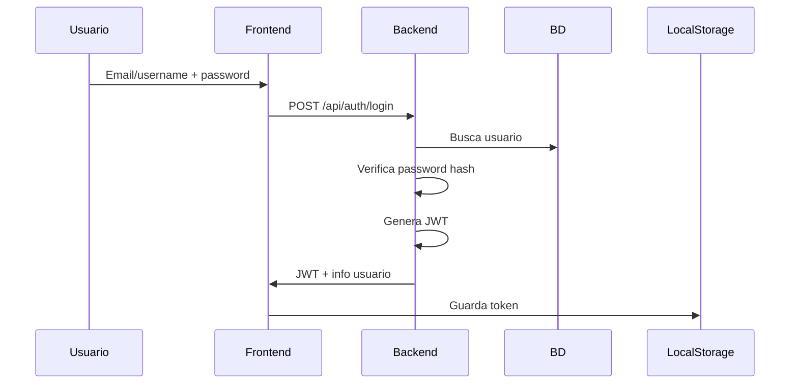

# 🔐 Sistema de Autenticación

Documentación del sistema de autenticación con JWT.

## 🏗️ Arquitectura

El sistema usa **JSON Web Tokens (JWT)** para autenticación stateless:

1. Usuario hace login con credenciales
2. Backend valida y genera JWT
3. Cliente guarda token (localStorage)
4. Cada request incluye token en header `Authorization`
5. Backend valida token en cada request

---

## 🔑 Flujo de Registro



### Validaciones en Registro

- **Username**: 3-80 caracteres, solo letras/números/guiones
- **Email**: Formato válido, único en sistema
- **Password**: Mínimo 6 caracteres (se hashea con bcrypt)

---

## 🔓 Flujo de Login



### Características

- ✅ Login con email O username
- ✅ Validación de password con bcrypt
- ✅ Token expira en 24h (configurable)
- ✅ Rate limiting: máx 5 intentos/minuto

---

## 🎫 Estructura del JWT

```javascript
{
  "header": {
    "alg": "HS256",
    "typ": "JWT"
  },
  "payload": {
    "user_id": 1,
    "email": "user@example.com",
    "exp": 1704470400  // Timestamp de expiración
  },
  "signature": "..."
}
```

---

## 🛡️ Protección de Rutas

### Backend

```python
from utils.jwt_utils import get_user_id_from_header

@app.route('/api/protected')
def protected_route():
    user_id = get_user_id_from_header()  # Lanza AuthError si inválido
    # Tu lógica aquí
```

### Frontend

```javascript
// api.js maneja automáticamente
const response = await api.getAccounts();
// Incluye: Authorization: Bearer <token>
```

---

## 🔒 Seguridad Implementada

### Passwords

- ✅ **Hashing**: bcrypt con salt automático
- ✅ **Validación**: Mínimo 6 caracteres
- ✅ No se almacenan en texto plano
- ✅ No se retornan en respuestas API

### Tokens

- ✅ **Firmados**: con SECRET_KEY seguro
- ✅ **Expiración**: 24 horas por defecto
- ✅ **Validación**: en cada request protegido
- ✅ httpOnly cookies (opcional)

### Rate Limiting

```python
# config.py
RATELIMIT_DEFAULT = "100 per minute"  # Global

# Específico para auth
@auth_bp.route('/login')
@limiter.limit("5 per minute")  # Solo 5 intentos
def login():
    ...
```

---

## 📱 Manejo en Frontend

### Almacenamiento del Token

```javascript
// api.js
setToken(token) {
    this.token = token;
    if (token) {
        localStorage.setItem('token', token);
    } else {
        localStorage.removeItem('token');
    }
}
```

### Verificación de Autenticación

```javascript
// auth-handler.js
async function checkAuth() {
    try {
        const user = await api.getCurrentUser();
        return true;
    } catch (error) {
        // Token inválido o expirado
        redirectToLogin();
        return false;
    }
}
```

### Auto-login

```javascript
// En páginas protegidas
window.addEventListener('DOMContentLoaded', async () => {
    const isAuth = await checkAuth();
    if (!isAuth) {
        window.location.href = 'login.html';
    }
});
```

---

## 🚪 Cerrar Sesión

```javascript
// Frontend
async function logout() {
    await api.logout();  // Notifica al backend (opcional)
    localStorage.removeItem('token');
    window.location.href = 'login.html';
}
```

---

## ⚠️ Errores Comunes

### Token Expirado

```json
{
  "error": "Token expired"
}
```

**Solución**: Re-autenticar usuario

### Token Inválido

```json
{
  "error": "Invalid token"
}
```

**Solución**: Limpiar localStorage y redirigir a login

### No Autenticado

```json
{
  "error": "No authorization header"
}
```

**Solución**: Verificar que el token se está enviando

---

## 🔄 Refresh Tokens (Futuro)

Próxima implementación:

- Access token: 15 minutos
- Refresh token: 7 días
- Endpoint `/auth/refresh` para renovar
- Rotación automática de tokens

---

## 📊 Métricas de Seguridad

- ✅ Secret key de 32+ bytes
- ✅ Passwords hasheados con bcrypt
- ✅ Rate limiting en endpoints sensibles
- ✅ CORS restrictivo
- ✅ Headers de seguridad (XSS, clickjacking)
- ✅ Validación de inputs con Marshmallow
- ✅ Sanitización automática

Ver más en [security.md](./security.md)
